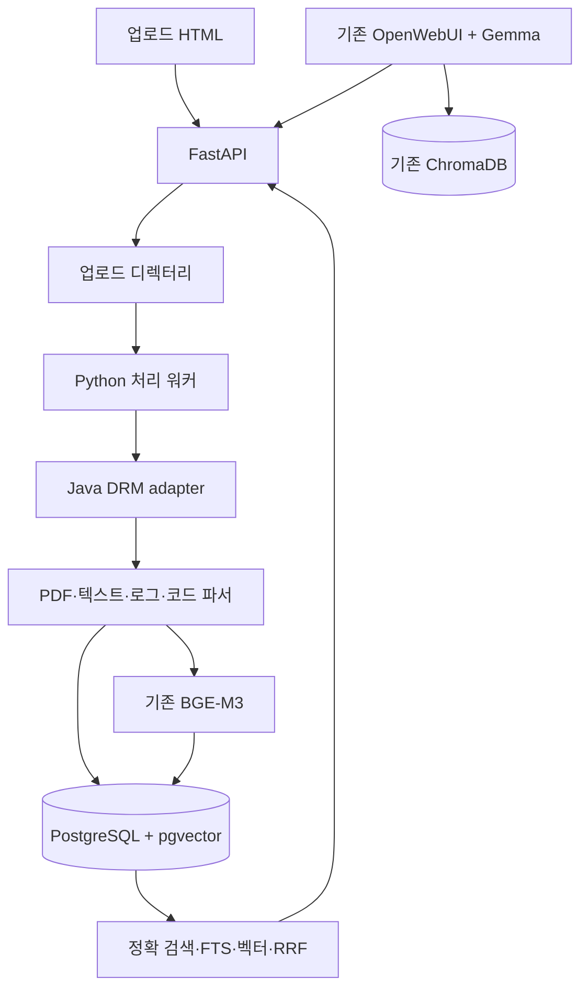

# 보험약관AI 지식자산 확장 구축안

작성일: 2026-09-23  
보고 목적: 기존 폐쇄망 LLM 서비스에 운영문서, 장애이력, 에러 로그, 소스코드 검색 기능을 단계적으로 추가하는 개발 초안 승인 및 시범 운영 범위 공유

## 1. 배경과 목표

현재 OpenWebUI·FastAPI·BGE-M3·reranker·ChromaDB 기반 보험약관 검색은 운영 중이다. 운영문서와 장애기록, 에러코드, 스택트레이스, 소스 위치까지 한 번에 찾아야 하는 요구가 추가됐다. PostgreSQL 17과 pgvector를 신규 설치하고 기존 시스템과 병행 운영한다. 검색 품질과 운영 안정성이 확인되면 ChromaDB를 제거한다.

## 2. 이번 산출물

| 항목 | 구현 내용 | 운영상 가치 |
| --- | --- | --- |
| 업로드 페이지 | 문서 유형·시스템·버전·저장소 정보와 파일을 등록 | 수집 경로와 작업 상태를 표준화 |
| 처리 워커 | 파일을 격리 보관하고 유형별로 파싱·청킹·임베딩 | 큰 PDF도 업로드 응답과 분리해 처리 |
| 검색 저장소 | pgvector 1024차원, FTS, 식별자 인덱스, 장애 프레임·코드 심볼 | 자연어와 에러코드, 클래스·메서드를 함께 조회 |
| DRM 연동 | Java 실행 파일을 호출하는 계약 및 임시파일 처리 | 사내 DRM 라이브러리를 별도 개발·연계 가능 |
| 검수 자료 | PDF 원본 구조 JSON, 정규화 JSON, 품질 지표 | 표 추출 실패와 원문 대조 근거 확보 |

## 3. 편집 가능한 아키텍처

같은 구성도를 독립 편집 가능한 `ARCHITECTURE_EDITABLE.mmd`로 제공한다. 아래 Mermaid 코드도 직접 수정해 재렌더링할 수 있다.

## 4. 단계별 추진

1. **환경 준비:** Rocky Linux 9 / Python 3.11, PostgreSQL 17 + pgvector·pg_trgm 설치. 사내망에서 Python wheel과 Docling·OCR·Java grammar 모델 반입. DB 권한과 암호/키 주입 경로 설정.
2. **시범 인덱싱:** 보험약관 일부, 운영 문서, 장애기록, 에러 로그, Java/Python 소스 샘플 처리. PDF 표 품질과 코드 심볼 위치 검수.
3. **병행 평가:** 기존 Chroma 검색과 PostgreSQL 검색에 동일 질문 30~50개를 적용해 문서·에러코드·코드 위치의 적중률, 근거 정확도, 응답 시간 및 장애 복구를 비교.
4. **연결·전환:** OpenWebUI FastAPI tool과 검색 결과 인용 연결, 사용자 수용 테스트, 백업/복구 점검을 거쳐 PostgreSQL 경로를 기본으로 변경. 이 단계 후 별도 변경 승인으로 Chroma 제거.

## 5. 확인이 필요한 운영 항목

- 사내 Java DRM 라이브러리 연동 방식과 복호화 권한/파일 보존 정책.
- 실제 BGE-M3 embedding API 경로/인증/차원 검증, reranker 모델 로컬 경로.
- 운영 문서의 버전 소유자, 폐기 기준, 시스템별 열람 권한과 로그의 개인정보 마스킹 기준.
- 대형 PDF/OCR의 실제 처리 시간과 처리 워커 자원 한도. 현재 구현은 단일 프로세스·순차 워커이며 처리량 산정은 실측 전이다.

## 6. 현재 구현 경계

이번 코드는 업로드/인덱싱/검색 API의 실험 가능한 기반이다. OpenWebUI 대화 생성과 자동 인용 연결, 코드 호출 관계 자동 추출, 이미지 내용의 별도 멀티모달 검색, 운영용 감사로그·세분화 권한·개인정보 마스킹은 추가 개발 대상이다. 기존 PDF OCR 정책 모듈은 자동 fallback 실행까지 구현하지 않았다. 사내 DRM 메서드도 별도 구현·통합이 필요하다.
