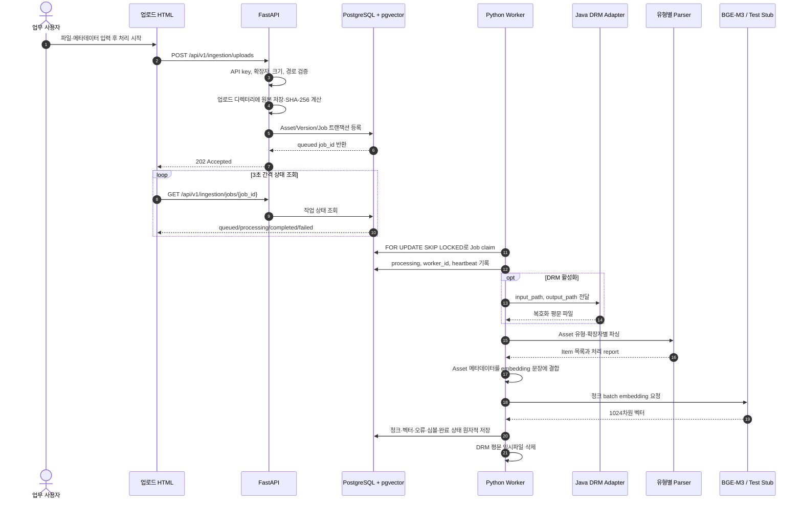
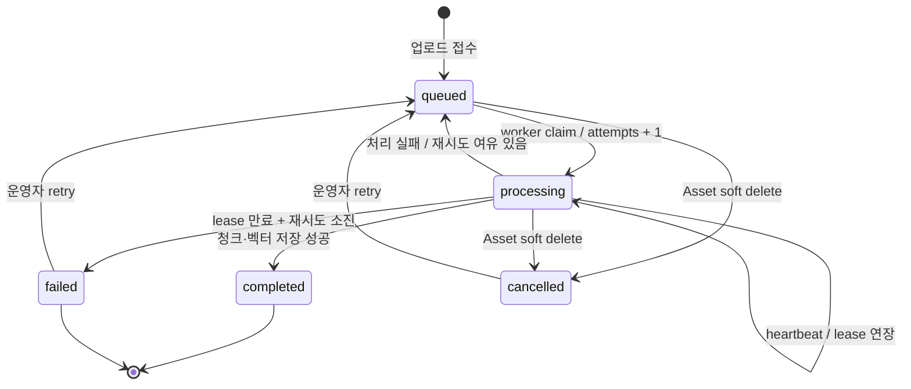
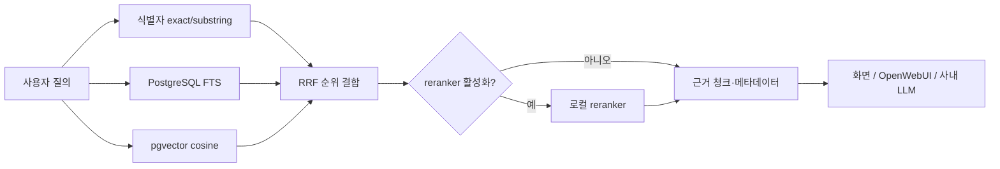

# ECM 문서 자산화 화면·API 업무 프로세스

## 1. 문서 목적

이 문서는 업로드 화면을 기준으로 사용자의 업무 동작이 어떤 API, Python 함수,
PostgreSQL 테이블과 worker 처리로 연결되는지 설명합니다. 화면 변경 및 코드 리뷰 시
다음 파일을 함께 비교하기 위한 기준 문서입니다.

- 화면: `web/upload.html`
- API 조립: `service/api.py`
- 업로드/상태 API: `service/routes/ingestion.py`
- 자산 API: `service/routes/assets.py`
- 검색 API: `service/routes/search.py`
- DB repository: `service/repositories/assets.py`, `service/repositories/jobs.py`
- 비동기 처리: `service/worker.py`
- 검색 처리: `service/search.py`
- DB 스키마: `sql/001_pgvector.sql`

RAG는 ECM 문서를 자산화한 뒤 찾고 재사용하기 위한 검색 계층입니다. 화면의 주 업무는
보험약관 질의응답이 아니라 ECM 자산의 원본, 버전, 메타데이터와 처리 이력을 등록하는
것입니다.

## 2. 화면에서 보이는 전체 업무 흐름



Mermaid 원문은 Markdown 안에서 직접 수정할 수 있습니다.

## 3. 화면 영역별 코드와 API

### 3.1 API 키

| 화면 항목 | 전송 위치 | 서버 처리 | 실패 결과 |
|---|---|---|---|
| API 키 | HTTP `X-API-Key` header | `service.dependencies.authorize()` | 누락/불일치 `401`, 서버 키 미설정 `503` |

API 키는 multipart FormData에 넣지 않습니다. 브라우저 JavaScript가 header로 분리해
전송합니다. 비교는 `hmac.compare_digest()`를 사용합니다.

### 3.2 자산 식별·분류 영역

| 화면 필드 | API 필드 | 저장 위치 | 의미 |
|---|---|---|---|
| 자산 유형 | `asset_type` | `rag.assets.asset_type` | document, incident, error_trace, source_code |
| 기존 Asset ID | `asset_id` | 기존 `rag.assets.asset_id` 참조 | 비우면 신규 자산, 입력하면 새 버전 |
| 세부 유형 | `subtype` | `rag.assets.subtype` | 업무별 자유 분류 코드 |
| 제목 | `title` | `rag.assets.title` | 비우면 업로드 파일명 사용 |
| 보안등급 | `security_level` | `rag.assets.security_level` | 접근통제 연계를 위한 분류 |

신규 자산은 `assets.create_asset()`을 호출합니다. 기존 Asset ID를 입력하면 Asset 존재와
유형 일치를 확인한 뒤 Version만 추가합니다.

### 3.3 업무 메타데이터 영역

| 화면 필드 | API 필드 | DB 컬럼 | 검색 활용 |
|---|---|---|---|
| 제조사 | `vendor` | `assets.vendor` | 검색 filter 및 embedding context |
| 제품 | `product` | `assets.product` | 검색 filter 및 embedding context |
| 시스템명 | `system_name` | `assets.system_name` | 검색 filter 및 embedding context |
| 서비스명 | `service_name` | `assets.service_name` | embedding context |
| 컴포넌트 | `component` | `assets.component` | embedding context |
| 소유 부서 | `owner_org` | `assets.owner_org` | 운영·접근정책 메타데이터 |

화면 표시 원문과 embedding 입력은 분리됩니다. `worker._add_asset_context()`는 위
메타데이터를 embedding 문장에 추가하지만 사용자에게 보여줄 원문은 변경하지 않습니다.

### 3.4 버전·수명주기 영역

| 화면 필드 | API 필드 | DB 컬럼 | 규칙 |
|---|---|---|---|
| 버전 | `version_label` | `asset_versions.version_label` | 업무 버전 문자열 |
| 상태 | `lifecycle_status` | `asset_versions.lifecycle_status` | draft, approved, obsolete |
| 현재 버전 | `is_current` | `asset_versions.is_current` | Asset당 true는 하나만 허용 |

`is_current=true`인 새 버전을 만들면 기존 현재 버전을 false로 바꿉니다. PostgreSQL의
partial unique index가 동시 요청에서도 현재 버전 하나만 허용합니다. 기본 검색은 현재
승인 버전만 대상으로 합니다.

### 3.5 소스코드 전용 영역

| 화면 필드 | API 필드 | 용도 |
|---|---|---|
| 저장소 | `repository` | 소스코드 Asset 필수값 |
| 브랜치 | `branch` | 심볼 출처 추적 |
| 상대 경로 | `logical_path` | 검색 결과 파일 경로 및 심볼 위치 |

`logical_path`는 절대경로, `..`, 역슬래시를 허용하지 않습니다. 실제 서버 파일 경로와
사용자에게 표시할 저장소 논리 경로를 분리하기 위한 필드입니다.

### 3.6 파일 영역과 처리 시작 버튼

버튼을 누르면 화면 JavaScript가 다음 API를 호출합니다.

```http
POST /api/v1/ingestion/uploads
X-API-Key: {api-key}
Content-Type: multipart/form-data
```

정상 응답은 처리 완료가 아니라 접수 완료입니다.

```json
{
  "asset_id": "UUID",
  "version_id": "UUID",
  "job_id": "UUID",
  "status": "queued",
  "size": 12345
}
```

화면은 받은 `job_id`로 3초마다 다음 API를 호출합니다.

```http
GET /api/v1/ingestion/jobs/{job_id}
X-API-Key: {api-key}
```

최대 240회, 약 12분간 조회하며 `completed` 또는 `failed`이면 polling을 종료합니다.

## 4. 작업 상태 전이



| 상태 | 화면 의미 | DB 처리 |
|---|---|---|
| queued | 처리 대기 | worker가 claim 가능한 상태 |
| processing | 파싱·임베딩·적재 중 | worker_id, heartbeat_at 기록 |
| completed | 검색 가능한 상태 | chunk_count, report, completed_at 기록 |
| failed | 자동 재시도 소진 | error_detail 확인 후 운영자 재시도 |
| cancelled | 자산 삭제 등으로 취소 | 명시적 retry 전에는 처리하지 않음 |

재시도 API:

```http
POST /api/v1/ingestion/jobs/{job_id}/retry
X-API-Key: {api-key}
```

## 5. Asset 관리 API

업로드 화면은 주로 등록과 상태 조회를 사용하지만, 관리 화면이나 OpenWebUI 연계에서는
다음 API로 ECM 자산을 관리할 수 있습니다.

| Method | Endpoint | 업무 기능 | 주요 결과 |
|---|---|---|---|
| POST | `/api/v1/assets` | 파일 없이 Asset 메타데이터 생성 | `201` |
| GET | `/api/v1/assets` | 활성 Asset 목록/필터 조회 | `200` |
| GET | `/api/v1/assets/{asset_id}` | Asset 단건 조회 | `200`, 미존재 `404` |
| PATCH | `/api/v1/assets/{asset_id}` | 전달한 필드만 수정 | `200` |
| DELETE | `/api/v1/assets/{asset_id}` | soft delete 및 진행 작업 취소 | `204` |
| GET | `/api/v1/assets/{asset_id}/versions` | 버전 이력 조회 | 내부 `source_path` 제외 |
| POST | `/api/v1/assets/{asset_id}/relations` | Asset 관계 생성 | `201`, 충돌 `409` |
| GET | `/api/v1/assets/{asset_id}/relations` | 연관 자산 조회 | `200` |
| DELETE | `/api/v1/assets/{asset_id}/relations/{target_id}/{type}` | 관계 삭제 | `204` |

삭제는 물리 삭제가 아닙니다. `assets.deleted_at`을 기록해 일반 조회와 검색에서 제외하고
대기·처리 중 작업을 cancelled로 바꿉니다. 버전과 기존 처리 결과는 감사 및 계보를 위해
보존합니다.

## 6. 검색 화면 또는 OpenWebUI 연계 흐름

검색 요청:

```http
POST /api/v1/search
X-API-Key: {api-key}
Content-Type: application/json

{
  "query": "전자결재 연계 운영지침",
  "asset_type": "document",
  "system_name": "전자결재",
  "include_obsolete": false,
  "limit": 10
}
```



검색 API는 답변을 생성하지 않습니다. Asset/Version/파일명/페이지·라인/근거 청크와 검색
점수를 반환하며, 생성형 답변이 필요하면 외부 응용 계층이 이 결과를 LLM 컨텍스트로
사용합니다.

## 7. 유형별 worker 처리

| Asset 유형/확장자 | 파서 | 주요 산출물 |
|---|---|---|
| document `.pdf` | Docling + 표 정규화 | docling.json, canonical.json, markdown, chunks |
| document `.docx` | python-docx | 문단·표 행 청크 |
| document `.txt/.md` | 텍스트 파서 | 문단 기반 청크 |
| incident `.txt/.md` | 장애 필드 파서 | 증상·원인·조치·결과 구조화 |
| error_trace `.log/.txt` | 로그/스택 파서 | 오류 이벤트, 코드, stack frame |
| source_code `.py` | Python AST | 클래스·함수 심볼과 라인 |
| source_code `.java` | tree-sitter | 패키지·클래스·메서드 심볼 |
| 기타 코드 | 파일 청크 | 저장소·브랜치·논리 경로 |

모든 파서는 공통 `Item` 목록과 report를 반환합니다. worker는 Item 수와 embedding 벡터
수가 같은지 확인한 뒤 `jobs.complete_job()`의 단일 트랜잭션으로 저장합니다.

## 8. 오류 응답과 화면 확인 기준

| 상황 | HTTP/상태 | 화면/운영자 조치 |
|---|---|---|
| API key 누락·오류 | `401` | 발급 키 확인 |
| 서버 API key 미설정 | `503` | `RAG_API_KEY`/YAML 확인 |
| 허용하지 않은 유형·확장자 | `422` | Asset 유형과 파일 확장자 확인 |
| 빈 파일 | `422` | 원본 파일 확인 |
| 용량 초과 | `413` | profile의 `max_upload_mb`와 파일 크기 확인 |
| 기존 Asset 유형 불일치 | `409` | 올바른 Asset ID 사용 또는 신규 등록 |
| 동일 원본 SHA-256 중복 | `409` | 기존 버전 확인 |
| DB 준비 안 됨 | `/health/ready` `503` | PostgreSQL/DSN/스키마 확인 |
| worker 처리 오류 | job `queued` 또는 `failed` | `error_detail`, attempts 확인 |

## 9. 코드 리뷰 체크리스트

### 화면 변경

- HTML `name`과 `ingestion.upload()` Form 파라미터가 동일한가?
- API key가 body나 URL에 포함되지 않고 header로 전달되는가?
- 새 terminal 상태가 추가되면 polling 종료 조건도 변경했는가?
- 브라우저 검증만 믿지 않고 서버 검증도 존재하는가?

### API 변경

- route는 HTTP 책임만 갖고 SQL을 repository에 위임하는가?
- 내부 `source_path`, `worker_id`, lease 정보가 응답에 노출되지 않는가?
- 오류가 401/404/409/422/503 등 의미 있는 상태 코드로 변환되는가?

### DB·queue 변경

- Version과 Job 생성이 한 트랜잭션인가?
- 다중 worker claim에 `FOR UPDATE SKIP LOCKED`가 유지되는가?
- lease를 잃은 worker가 결과를 덮어쓰지 못하는가?
- 재처리 시 이전 부분 청크가 남지 않는가?

### 보안·DRM 변경

- 업로드 경로가 설정된 upload_root 내부인지 확인하는가?
- subprocess를 shell 문자열로 실행하지 않는가?
- 복호화 평문 임시파일이 성공·실패 모두에서 삭제되는가?
- 비밀값이 YAML, 로그, API 응답에 포함되지 않는가?

### 검색 변경

- exact/FTS/vector 모든 lane에 같은 보안·수명주기 필터가 적용되는가?
- embedding 차원과 PostgreSQL `vector(N)`이 일치하는가?
- 사용자 표시 원문과 embedding용 문장을 혼동하지 않는가?
- 검색 결과에 Asset/Version/파일/페이지 또는 라인 근거가 포함되는가?

## 10. 관련 검증

자동 통합 테스트는 `tests/integration/test_postgres_service.py`에 있습니다. PostgreSQL
테스트 DSN을 설정하면 상태 확인, 인증, Asset CRUD, 업로드, worker, pgvector 적재와
검색 round-trip을 검증합니다. 실행 방법은 `tests/integration/README.md`를 참고합니다.
